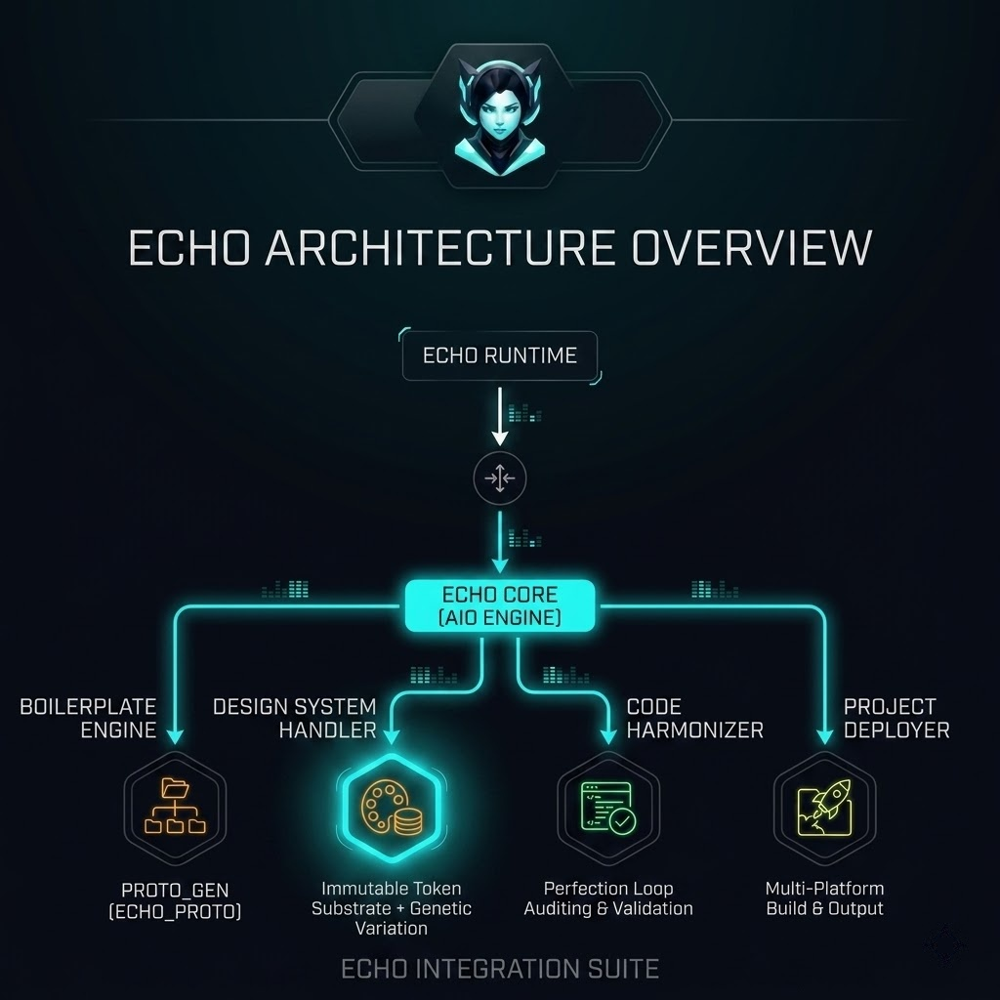

<!-- markdownlint-disable MD033 -->
<div align="center">



# ECHO PROTOCOL v0.1.3

**Universal Agent Bootstrap. Language-Agnostic. Zero-Cost.**

> **This is the landing page.** For the protocol specification (the single source
> of truth for all agent behavior), see [ECHO.md](ECHO.md). Content below is
> summarized for quick orientation — ECHO.md is authoritative.

A structured quality gate framework for AI agent sessions. Drop into any project
to enforce test-driven development, iterative refinement, honest verification,
and mandatory coding standards — regardless of language.

**15 Laws** governing all agent behavior (4 immutable process + 11 extended code). **Five Questions** evaluation framework. **Perfection Loop FSM** with
Levenshtein-constrained change control. **Circuit breaker rules** preventing
oscillation and runaway loops. **Anti-patterns** explicitly forbidden. **Emergency procedures** for stuck states. Enterprise-grade agent discipline out of the box.

[](LICENSE)
[](coding-standards/rust.md)
[](coding-standards/typescript.md)
[](coding-standards/python.md)
[](coding-standards/go.md)
[](coding-standards/java.md)
[](coding-standards/csharp.md)
[](coding-standards/x402.md)

</div>

> **Drop this into any project. Your AI agent now follows 15 engineering laws,
> catches its own mistakes with a finite state machine, and can't loop forever.**

## 30-Second Quickstart

```text
1. Copy this repo into your project root
2. Edit protocol.config.yaml → set your language + build/test commands
3. Paste the starter prompt from STARTER-PROMPT.md into your agent's system prompt
```

Your agent will boot, prove it read the rules, and begin working under full protocol discipline.

> **Note:** The `dev/fids/`, `dev/fids/archive/`, and `dev/session-summaries/`
> directories are gitignored and created at runtime. The agent will create them
> automatically on first session. If you need them manually: `mkdir -p dev/fids/archive dev/session-summaries`

---

## Overview

The ECHO Protocol is a universal agent bootstrap system that enforces structured
engineering discipline on any AI agent, in any language, on any project:

- **15 Laws** — 4 immutable process laws (read first, present before act, verify, call-graph reachability) + 11 extended code laws (no placeholders, no type safety shortcuts, search existing code, log intent, production documentation, update tracking, follow patterns, no sensitive data in logs, utility-first, all error paths handled, build stays clean)
- **Five Questions** — Evaluation framework: works for ALL cases? Scales to 1000? Survives hostile attacker? Maintainable in 2 years? Sets industry standard?
- **Perfection Loop FSM** — 5-state finite state machine (RED → GREEN → AUDIT → SELF-CORRECT → COMPLETE) with mandatory transitions and convergence detection
- **Levenshtein Change Control** — 10% character-change cap per pass prevents oscillation and ensures stable convergence
- **Circuit Breaker Rules** — 5 hard rules preventing runaway loops: max changes, random sample verification, convergence detection, oscillation detection, and hard iteration stop
- **Double Audit** — Every change verified by two independent methods (static analysis + runtime tests). Self-reporting is prohibited
- **Language-Agnostic Design** — Core protocol is language-neutral. Language-specific rules live in `coding-standards/{language}.md`. Configuration lives in `protocol.config.yaml`
- **FID Lifecycle** — Feature Implementation Documents track bugs, architectural issues, and improvements through a structured lifecycle: Created → Analyzed → Fixed → Verified → Closed → Archived
- **Session Management** — Structured session lifecycle with start/during/end phases, automatic summaries, and cross-session learning via `LEARNINGS.md`
- **Honest Assessment** — All claims must be verifiable through tool output. No self-reporting. No assumptions. Proof or it didn't happen
- **Anti-Patterns** — 10 explicitly forbidden behaviors (simplest approach, quick fix, speed over quality, good enough, swallowed errors, etc.)
- **Emergency Procedures** — Recovery protocols for stuck states: test failures, compilation failures, looping detection
- **Autonomy Levels** — 3 levels: Guided (user present), Supervised (user available), Autonomous (default, push at will)
- **Template Library** — Pre-built templates for FIDs and session summaries ensure consistent documentation across all agent sessions

---

## The 15 Laws

### Laws 1-4: The Immutable Process Laws

| # | Law | Purpose |
| :-: | :--- | :--- |
| 1 | **Read 0-EOF Before Touch** | Every file read completely before any edit. No exceptions. |
| 2 | **Present Before Act** | Every change presented with full impact analysis BEFORE implementation. |
| 3 | **Verify Before Proceed** | Every change verified with build/test commands before moving on. |
| 4 | **Verify Call-Graph Reachability** | After wiring any feature, grep entry points to confirm it is called. |

### Laws 5-15: The Extended Code Laws

| # | Law | Purpose |
| :-: | :--- | :--- |
| 5 | **No pseudo-code, TODOs, or placeholders** | Every line must be production-ready |
| 6 | **No type safety shortcuts** | Use language-appropriate safe patterns (see coding-standards) |
| 7 | **Search existing code first** | Expand existing functions before creating duplicates |
| 8 | **Log intent before coding** | Document the intended change before implementation |
| 9 | **Production-grade documentation** | Module-level docs, API contracts, error conditions |
| 10 | **Update tracking after every feature** | FID status, changelog, progress tracker |
| 11 | **Follow discovered patterns exactly** | Consistency over cleverness |
| 12 | **No sensitive data in logs** | Never expose keys, tokens, passwords, or PII |
| 13 | **Utility-first, universal logic** | One function, one truth. Combine overlap. |
| 14 | **All error paths handled** | Every fallible operation must have its error propagated or explicitly handled |
| 15 | **Build stays clean** | Zero errors, zero warnings after every edit |

---

## Perfection Loop FSM

```text
┌──────────────────────────────────────────────────────────────┐
│                    PERFECTION LOOP                           │
│                    Finite State Machine                      │
│                                                              │
│  ┌─────────┐    ┌──────────┐    ┌─────────┐    ┌─────────┐ │
│  │   RED   │───>│  GREEN   │───>│  AUDIT  │───>│  SELF   │ │
│  │  PHASE  │    │  PHASE   │    │  PHASE  │    │ CORRECT │ │
│  └─────────┘    └─────┬────┘    └─────────┘    └────┬────┘ │
│       ^                │                             │      │
│       │                │           ┌──────────┐      │      │
│       │                │           │ COMPLETE │<─────┘      │
│       │                │           └──────────┘  (if audit  │
│       │                │                         passes)    │
│       │                │                                    │
│       │                └────────────────────────────────────┘
│       │                   (corrections applied → re-verify)
│       │
│       └─────────────────── (if new issues found)
└──────────────────────────────────────────────────────────────┘
```

| State | Entry Condition | Actions | Exit Condition |
| :--- | :--- | :--- | :--- |
| **RED** | Start of loop | Identify ALL failures and issues | All issues cataloged |
| **GREEN** | RED complete | Fix issues with MINIMAL changes | All fixes applied |
| **AUDIT** | GREEN complete | Double-audit with honest assessment | Audit passes/fails |
| **SELF-CORRECT** | AUDIT failed | Address audit findings | Corrections applied |
| **COMPLETE** | AUDIT passed | Document results | Loop ends |

### Circuit Breaker Rules

1. **Max Changes Per Pass** — 10% of total character count
2. **Verification** — 500-char random sample comparison after each change
3. **Convergence Detection** — Stop if change delta < 2% for 2 consecutive passes
4. **Oscillation Detection** — If same issue reappears 3 times, escalate
5. **Hard Stop** — 10 maximum iterations per loop

---

## Quick Start

### 1. Copy Into Your Project

```bash
cp -r savant-protocol/ /path/to/your/project/
```

### 2. Configure for Your Language

Edit `protocol.config.yaml`:

```yaml
language: "rust"  # rust | typescript | python | go | java | csharp

commands:
  build: "cargo build"
  test: "cargo test"
  type_check: "cargo check"
  lint: "cargo clippy -- -D warnings"
  format: "cargo fmt"
  clean: "cargo clean"
```

### 3. Activate the Protocol

Copy the starter prompt from `STARTER-PROMPT.md` into your agent's system prompt.
The agent will be forced to read the protocol files and prove compliance before
beginning any work.

### 4. Verify Compliance

The agent must complete the boot sequence:

1. List all 15 Laws by number and exact name
2. Confirm language, all 6 validation commands, and `max_file_lines`, `max_function_lines`, `max_line_length` from config
3. Confirm naming conventions from the language-specific coding standard
4. State the 5 Perfection Loop FSM states in order
5. State all 5 circuit breaker rules
6. List all directory paths from config
7. Confirm the autonomy level from config

---

## Project Structure

```text
savant-protocol/
├── ECHO.md                      # Universal bootstrap (read this first)
├── protocol.config.yaml         # Project-specific configuration
├── STARTER-PROMPT.md            # Agent activation prompts (universal + language-specific)
├── MIGRATION.md                 # Retrofit guide for existing projects
├── VERSION                      # Protocol version
├── CHANGELOG.md                 # Auto-updated by agent on FID closure
├── LICENSE                      # MIT License
├── README.md                    # This file (landing page — see ECHO.md for spec)
├── .markdownlint.json           # Markdownlint configuration
├── overview.jpg                 # Protocol overview diagram
├── coding-standards/            # Language-specific naming and style
│   ├── rust.md                  #   Rust conventions (PascalCase structs, snake_case fns)
│   ├── typescript.md            #   TypeScript conventions (camelCase, strict mode)
│   ├── python.md                #   Python conventions (snake_case, type hints)
│   ├── go.md                    #   Go conventions (exported/unexported, error returns)
│   ├── java.md                  #   Java conventions (PascalCase classes, exception hierarchy)
│   └── csharp.md               #   C# conventions (PascalCase, async/await, I-prefix interfaces)
├── templates/                   # Document templates
│   ├── FID-TEMPLATE.md          #   Feature Implementation Document template
│   └── SESSION-SUMMARY.md      #   Session summary template
└── dev/                         # Runtime state (gitignored, created at runtime)
    ├── LEARNINGS.md             # Cross-session lessons learned
    ├── fids/                    # Active FIDs (Created → Verified lifecycle)
    │   └── archive/             # Closed FIDs auto-moved here
    └── session-summaries/       # Session summaries (YYYY-MM-DD-HHMM format)
```

---

## Configuration Reference

| Field | Default | Description |
| :--- | :--- | :--- |
| `language` | `CHANGE_ME` | Project language (`rust`, `typescript`, `python`, `go`, `java`, `csharp`) |
| `commands.build` | placeholder | Compile/build command |
| `commands.test` | placeholder | Test runner command |
| `commands.type_check` | placeholder | Type checking command |
| `commands.lint` | placeholder | Linting command |
| `commands.format` | placeholder | Code formatting command |
| `commands.clean` | placeholder | Clean/build artifact removal command |
| `quality.max_file_lines` | `300` | Maximum lines per file |
| `quality.max_function_lines` | `50` | Maximum lines per function |
| `quality.max_line_length` | `100` | Maximum characters per line |
| `quality.max_complexity` | `10` | Maximum cyclomatic complexity |
| `quality.max_params` | `4` | Maximum function parameters |
| `quality.max_comment_density` | `0.33` | Max comment-to-code ratio |
| `quality.max_nesting_depth` | `3` | Maximum nesting depth |
| `testing.fuzz_enabled` | `false` | Enable fuzz testing |
| `testing.mutation_enabled` | `false` | Enable mutation testing |
| `testing.coverage_threshold` | `80` | Minimum coverage percentage |
| `testing.test_timeout` | `30` | Test timeout in seconds |
| `testing.parallel_tests` | `true` | Run tests in parallel |
| `fid.auto_create` | `true` | Auto-create FIDs for discovered issues |
| `fid.severity_levels` | `["critical", "high", "medium", "low"]` | Valid severity levels |
| `fid.max_open_fids` | `20` | Maximum concurrent open FIDs |
| `perfection_loop.max_iterations` | `10` | Hard stop for Perfection Loop |
| `perfection_loop.change_threshold` | `0.10` | Max 10% character change per pass |
| `perfection_loop.convergence_threshold` | `0.02` | Convergence detection threshold |
| `perfection_loop.convergence_passes` | `2` | Consecutive passes below threshold to trigger convergence |
| `perfection_loop.oscillation_limit` | `3` | Same-issue reappearance limit |
| `session.auto_summary` | `true` | Auto-generate session summaries |
| `session.summary_interval` | `30` | Summary interval in minutes |
| `session.max_session_hours` | `4` | Maximum session duration |
| `session.autonomy_level` | `3` | 1=Guided, 2=Supervised, 3=Autonomous (default) |

---

## Adding a New Language

1. Create `coding-standards/{language}.md` following the existing templates
2. Set `language: "{language}"` in `protocol.config.yaml`
3. Update `commands` section with your toolchain
4. Add a language-specific variant to `STARTER-PROMPT.md`

---

## FID Lifecycle

Feature Implementation Documents (FIDs) track discovered issues through resolution:

```text
Created → Analyzed → Fixed → Verified → Closed → Archived
   │         │         │         │          │         │
   └─────────┴─────────┴─────────┴──────────┴─────────┘
        All stages require evidence
```

When to create a FID:

- Bug discovered during implementation
- Architectural issue identified
- Performance bottleneck found
- Security concern noticed
- Improvement opportunity seen

**Auto-Archive:** When a FID reaches `Closed` status, the agent moves it to
`dev/fids/archive/` and logs the archival in the session summary.

**Auto-Changelog:** On FID closure, the agent appends an entry to `CHANGELOG.md`
with the FID ID, severity, description, and resolution summary.

See `templates/FID-TEMPLATE.md` for the standard format.

---

## Session Lifecycle

| Phase | Actions |
| :--- | :--- |
| **Start** | Read ECHO.md, load config, load coding standards, review LEARNINGS.md, review open FIDs, create session summary |
| **During** | Work one task at a time, follow Perfection Loop, create/update FIDs, auto-archive closed FIDs, update CHANGELOG, update summary |
| **End** | Run all validation commands, update session summary, note blockers, update LEARNINGS.md |

---

## Documentation

- [ECHO Protocol](ECHO.md) — The universal bootstrap specification
- [Starter Prompts](STARTER-PROMPT.md) — Agent activation prompts for all languages
- [Migration Guide](MIGRATION.md) — Retrofit protocol into existing projects
- [Rust Standards](coding-standards/rust.md) — Rust naming conventions and patterns
- [TypeScript Standards](coding-standards/typescript.md) — TypeScript naming conventions and patterns
- [Python Standards](coding-standards/python.md) — Python naming conventions and patterns
- [Go Standards](coding-standards/go.md) — Go naming conventions and patterns
- [Java Standards](coding-standards/java.md) — Java naming conventions and patterns
- [C# Standards](coding-standards/csharp.md) — C# naming conventions and patterns
- [FID Template](templates/FID-TEMPLATE.md) — Feature Implementation Document template
- [Session Summary Template](templates/SESSION-SUMMARY.md) — Session summary template
- [Changelog](CHANGELOG.md) — Auto-updated on FID closure

---

<div align="center">

_Engineered discipline for autonomous agents._

**ECHO Protocol** is the specification. **Savant** is the project/organization
that created and maintains it. The repo is named `savant-protocol` because
Savant is the parent project; ECHO is the agent discipline protocol within it.

**Savant** &bull; 2026

</div>
